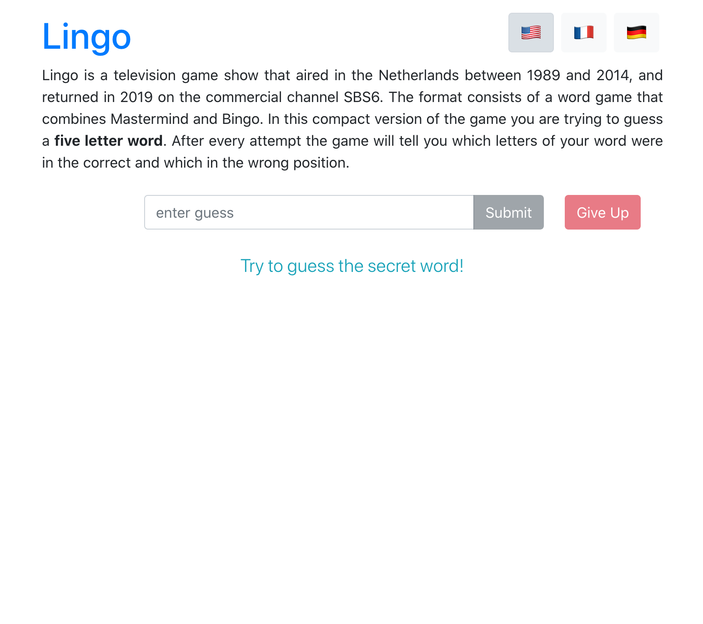
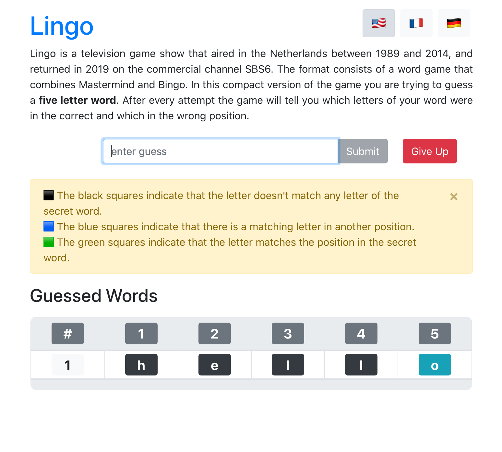
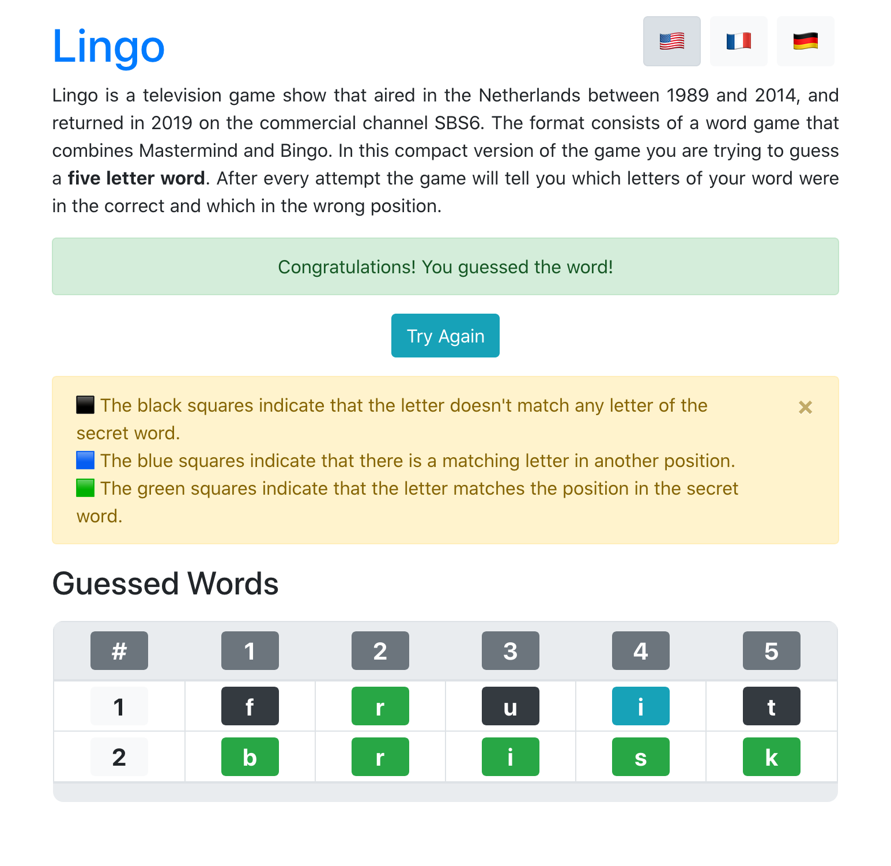
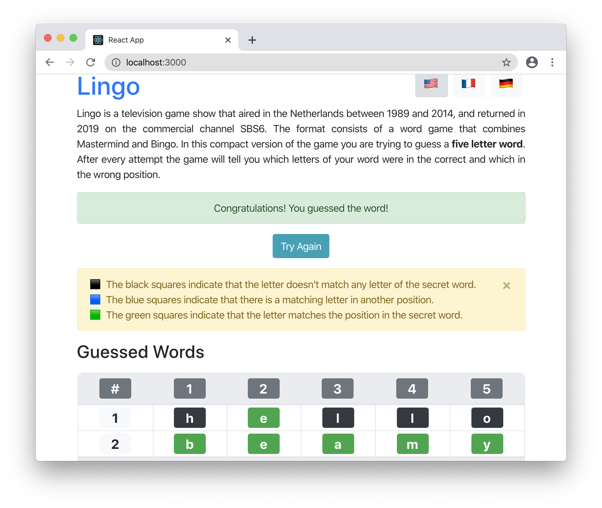

# Lingo
## Abstract
This is a SPA version of the dutch television game Lingo. It is translated into three languages and offers own sets of words for each.

## Technologies
 - React
 - Enzyme
 - Express
 - Bootstrap

## Screenshots

## Kudos
This project is built with create-react-app. Also it is based on test driven development practices taught by Bonnie Schulkin.